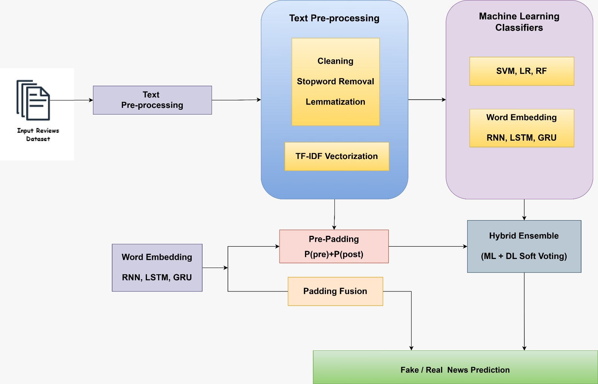
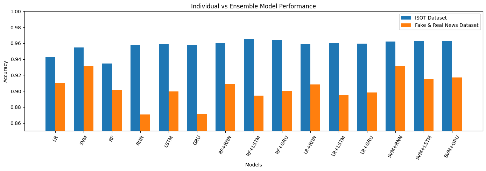
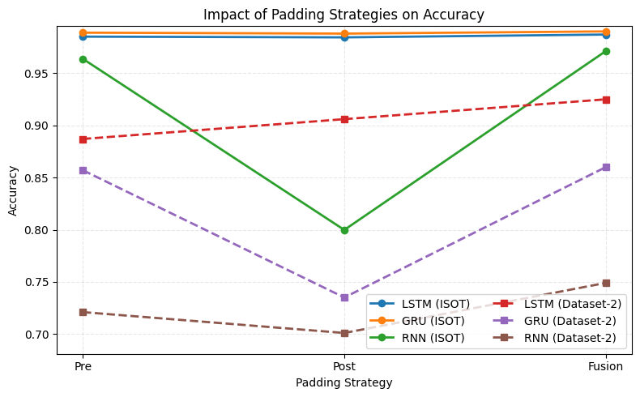

# Hybrid Learning Approach for Detecting Fake News with Machine Learning and Deep Learning Models

A hybrid ensemble framework that combines classical ML classifiers (SVM, Logistic Regression, Random Forest) with recurrent deep learning models (RNN, LSTM, GRU) for fake news detection — using TF-IDF statistical features, word-embedding semantic features, pre/post-padding fusion, and soft-voting ensembles.

**Presented at ICAN 2026** — 6th International Conference on AI-driven Computing, Analytics and Networks, Chitkara University.

> This repository accompanies the paper. It contains the published paper (PDF + LaTeX source), the experiment notebooks, all figures, and the results exactly as reported.

## Implementation

The experiments were run in Google Colab. The notebooks are included here as PDF exports (the original `.ipynb` files were not available):

| Notebook | Contents |
|---|---|
| [`notebooks/fake-news-ml-dl-isot-dataset1.pdf`](notebooks/fake-news-ml-dl-isot-dataset1.pdf) | ISOT dataset: EDA and text-length analysis, preprocessing, TF-IDF + ML models (Logistic Regression, SVM, Random Forest), tokenization + DL models (RNN, LSTM, GRU), hybrid soft-voting ensembles with and without attention |
| [`notebooks/fake-news-ml-dl-kaggle-dataset2.pdf`](notebooks/fake-news-ml-dl-kaggle-dataset2.pdf) | Same pipeline on the Kaggle Fake_Real_News_Data dataset |
| [`notebooks/fake-news-pre-post-padding-ensemble.pdf`](notebooks/fake-news-pre-post-padding-ensemble.pdf) | Pre-padding vs post-padding training and probability-fusion ensembles on both datasets |

Notes:
- Dataset paths inside the notebooks (e.g. `/content/drive/MyDrive/...`) point to the original author's Google Drive — datasets are not bundled here. Download the [ISOT Fake News Dataset](https://www.uvic.ca/engineering/ece/isot/) (Ahmed, 2019) and the [Fake_Real_News_Data](https://www.kaggle.com/) set from Kaggle separately, then update the load paths.
- Stack: Python, pandas, scikit-learn, TensorFlow/Keras.

## Authors

- M. L. S. Bhargava Sai — Dept. of Advanced Computer Science and Engineering, VFSTR
- K. Charan — Dept. of Advanced Computer Science and Engineering, VFSTR
- **M. Tasleem** — Dept. of Advanced Computer Science and Engineering, VFSTR
- P. Ramesh — Dept. of Advanced Computer Science and Engineering, VFSTR
- Supervisor: Brundavanam Satyasai, Assistant Professor, VFSTR

## Method



1. **Preprocessing** — URLs, symbols and non-textual content removed; tokenization, stop-word removal, lemmatization.
2. **Feature representation** — TF-IDF statistical features for the ML classifiers; pre-trained word embeddings for the DL models.
3. **ML classifiers** — SVM, Logistic Regression, Random Forest on TF-IDF features.
4. **DL sequence models** — RNN, LSTM, GRU on embeddings. Each model is trained twice, once with **pre-padding** and once with **post-padding**, and the two are fused by probability averaging to reduce sequence-alignment bias:
   
   `P_fusion = (P_pre + P_post) / 2`
5. **Hybrid ensemble** — ML and fused-DL outputs combined with soft voting:
   
   `P_ensemble = (P_ML + P_DL) / 2`, label = Fake if `P_ensemble ≥ 0.5`.

## Datasets

| Dataset | Size | Real | Fake | Source |
|---|---|---|---|---|
| ISOT Fake News | 44,919 articles | 21,417 | 23,502 | Ahmed (2019), University of Victoria |
| Fake_Real_News_Data | 6,335 articles | 3,171 | 3,164 | Kaggle |

Both datasets use an 80:20 stratified train/test split. Full result tables are in [`results/results.md`](results/results.md).

## Key results

**ISOT dataset** — best hybrid ensemble **RF + LSTM: 96.50% accuracy**; best padding-fusion model **GRU (pre+post): 99.01% accuracy**.

| Model | Accuracy |
|---|---|
| Logistic Regression | 94.24% |
| SVM | 95.47% |
| Random Forest | 93.44% |
| RNN | 95.77% |
| LSTM | 95.86% |
| GRU | 95.76% |
| RF + RNN | 96.05% |
| LR + LSTM | 96.04% |
| SVM + RNN | 96.20% |
| SVM + LSTM | 96.28% |
| SVM + GRU | 96.28% |
| **RF + LSTM** | **96.50%** |
| RF + GRU | 96.40% |

Padding fusion on ISOT: LSTM (pre+post) 98.71%, **GRU (pre+post) 99.01%**, RNN (pre+post) 97.12%.

**Fake_Real_News_Data** — SVM 93.13%; best ensemble SVM + Attention-RNN 93.13%; LSTM padding fusion 92.50%.




## Repository contents

```
├── paper/
│   ├── Hybrid_Fake_News_Detection.pdf   # the published paper
│   └── main.tex                         # LaTeX source (IEEEtran)
├── notebooks/
│   ├── fake-news-ml-dl-isot-dataset1.pdf       # Colab notebook export: ISOT experiments
│   ├── fake-news-ml-dl-kaggle-dataset2.pdf     # Colab notebook export: Kaggle dataset experiments
│   └── fake-news-pre-post-padding-ensemble.pdf # Colab notebook export: pre/post padding fusion
├── figures/
│   ├── fig1-framework.jpg               # proposed framework (Fig. 1)
│   ├── fig2-model-comparison.png        # individual vs ensemble (Fig. 2)
│   ├── fig3-padding-fusion.png          # padding strategy comparison (Fig. 3)
│   ├── framework-draft-v1.png           # alternate framework diagram draft
│   └── framework-draft-v2.png           # alternate framework diagram draft
└── results/
    └── results.md                       # full result tables as reported
```

## Citation

If you use this work, please cite the paper:

> M. L. S. Bhargava Sai, K. Charan, M. Tasleem, P. Ramesh, and B. Satyasai, "Hybrid Learning Approach for Detecting Fake News with Machine Learning and Deep Learning Models," *Proc. 6th Int. Conf. on AI-driven Computing, Analytics and Networks (ICAN 2026)*, Chitkara University.

## License

© 2026 the authors. Paper and figures are shared for academic reference.
